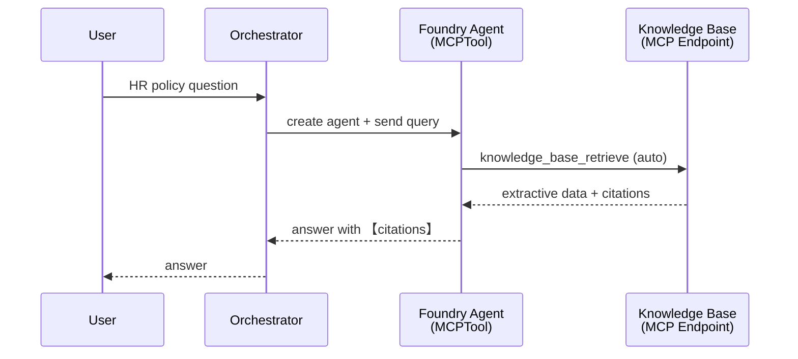
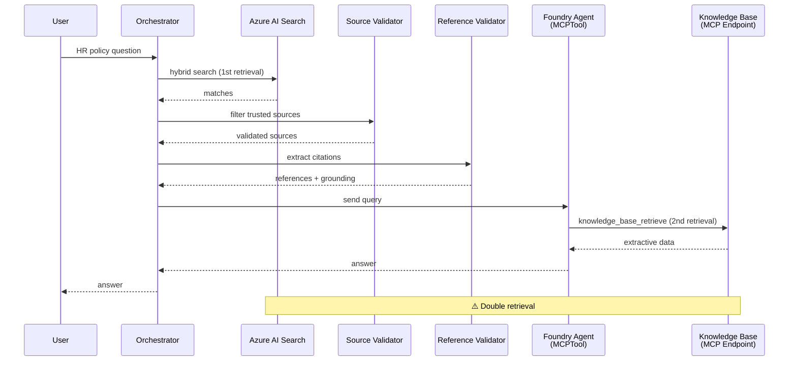

# Foundry Agent Architecture — MCP Agentic Retrieval

## Overview

This document describes the Foundry Agent orchestrator architecture for HR policy
knowledge retrieval using Azure AI Search agentic retrieval with MCP (Model Context
Protocol).

The architecture follows the **Microsoft recommended pattern** for end-to-end agentic
retrieval:

- [Tutorial: Build an agentic retrieval pipeline](https://learn.microsoft.com/en-us/azure/search/agentic-retrieval-how-to-create-pipeline)
- [Sample notebook: agent-example.ipynb](https://github.com/Azure-Samples/azure-search-python-samples/blob/main/agentic-retrieval-pipeline-example/agent-example.ipynb)

---

## Pipeline Modes

The orchestrator is selected via the `ORCHESTRATOR_PATTERN` environment variable
(default: `A`). Both patterns are accessed through the factory:

```python
from agents.orchestrator_factory import get_orchestrator
orchestrator = get_orchestrator()  # reads ORCHESTRATOR_PATTERN env var
```

### Pattern A: Single-Agent MCP (`ORCHESTRATOR_PATTERN=A`, default)

```
User Query → Foundry Agent (MCPTool + tool_choice="required") → Answer with Citations
```

A **single Foundry Agent** with an MCPTool handles retrieval, reasoning, and citation
formatting in one pass.  This is the Microsoft recommended architecture.

**How it works:**

1. The orchestrator creates a Foundry Agent with the `MCPTool` pointing to the
   Azure AI Search knowledge base MCP endpoint.
2. `tool_choice="required"` ensures the agent **always** calls `knowledge_base_retrieve`
   — it never answers from its own training data.
3. The knowledge base handles query decomposition, semantic reranking, and extractive
   data retrieval.
4. The agent receives the retrieved content, reasons over it, and produces a
   natural-language answer with inline MCP citations.

**Why single-agent is preferred:**

| Concern | Single-Agent | Multi-Step (4 agents) |
|---------|-------------|----------------------|
| Azure AI Search calls | 1 | 2 (double retrieval) |
| Latency | Lower | ~2× higher |
| Citation quality | Agent-native MCP annotations | Manual extraction |
| Source trust | Enforced at index level | Extra container filter |
| Complexity | Minimal | High |

The knowledge base only searches the configured index (`hr_lab_index`), which only
contains documents from the trusted blob container.  Source validation is enforced at
the **infrastructure level**, making a separate validation step redundant.

### Pattern B: Hybrid MCP + Metadata Lookup (`ORCHESTRATOR_PATTERN=B`)

```
User Query → Foundry Agent (MCPTool + FunctionTool, tool_choice="required")
    ├─ knowledge_base_retrieve  → content/policy questions (MCP)
    └─ file_metadata_lookup     → file-location questions (direct search)
```

Pattern B adds a **custom function tool** (`file_metadata_lookup`) alongside the MCP
tool on a single Foundry Agent. The agent routes queries to the appropriate tool based
on instructions:

- **Content questions** ("What does Policy 51350 say?") → `knowledge_base_retrieve`
- **File-location questions** ("Where is the PTO policy stored?") → `file_metadata_lookup`

**Key implementation detail:** The Foundry Agent API does not transparently handle MCP
tool calls when mixed with a FunctionTool on the same agent. When the agent calls
`knowledge_base_retrieve`, the client **intercepts** the call, executes
`agentic_retrieve()` directly, and submits the result back as `function_call_output`.
This preserves the MCP architecture while providing direct access to activity data
(subqueries, elapsed times).

**Why Pattern B for file-location queries:**

| Concern | Pattern A (MCP only) | Pattern B (MCP + metadata tool) |
|---------|---------------------|-------------------------------|
| Content answers | ✓ Full KB retrieval | ✓ Full KB retrieval (intercepted) |
| File paths/URLs | LLM-synthesized (may hallucinate) | Deterministic from index |
| Activity data | Not captured | Direct access via interception |
| Latency (content) | ~10–15s | ~20–35s (agentic_retrieve + response) |
| Latency (metadata) | ~10–15s | ~5–10s (hybrid_search only) |

### OPTIONAL: Multi-Step Pipeline (`PIPELINE_MODE=multi_step`)

```
Step 1 → RetrievalAgent         (hybrid search against the index)
Step 2 → SourceValidatorAgent   (filter by trusted container)
Step 3 → ReferenceValidatorAgent (extract citations, check grounding)
Step 4 → Foundry Agent + MCP    (answer synthesis)
```

> ⚠️ **Not recommended for production.**  This performs double retrieval: Step 1
> queries Azure AI Search, then Step 4's MCP tool queries it again.  Provided as a
> **learning reference** for developers who want to understand multi-agent
> coordination patterns.

**When to use multi-step:**

- Learning/experimentation with multi-agent orchestration
- Scenarios where you need pre-retrieval filtering beyond what the index provides
- Cases where you want explicit audit logging of each validation step

---

## Optional: Citation Validation (`VALIDATE_CITATIONS=true`)

When enabled, the orchestrator post-processes the agent's response to validate
MCP citation annotations.

```
User Query → Foundry Agent (MCP) → [Validate Citations] → Return
```

**What it checks:**

- Presence of MCP citation annotations: `【message_idx:search_idx†source_name】`
- Extraction of structured citation metadata (message index, search index, source name)
- Count of citations in the response

**Enable it:**

```bash
export VALIDATE_CITATIONS=true
```

The validation results are included in the response under the `citation_validation` key:

```json
{
  "citation_validation": {
    "has_citations": true,
    "citation_count": 3,
    "citations": [
      {"message_idx": 0, "search_idx": 1, "source_name": "50715 - Hours Worked..."},
      {"message_idx": 0, "search_idx": 2, "source_name": "51350 - Types of Leave..."}
    ]
  }
}
```

---

## Environment Variables

| Variable | Default | Description |
|----------|---------|-------------|
| `ORCHESTRATOR_PATTERN` | `A` | Pattern: `A` (single-agent MCP) or `B` (hybrid MCP + metadata lookup) |
| `PIPELINE_MODE` | `single_agent` | Pipeline mode: `single_agent` (recommended) or `multi_step` (learning) |
| `VALIDATE_CITATIONS` | `false` | Enable post-processing citation validation |
| `PERSIST_FOUNDRY_AGENTS` | `false` | Keep Foundry Agents after invocation (otherwise cleaned up) |
| `AZURE_AI_PROJECT_ENDPOINT` | — | Foundry project endpoint |
| `AZURE_AI_MODEL_DEPLOYMENT_NAME` | `gpt-5` | Model deployment for the agent |

---

## Agent Instructions (MS Recommended Template)

The agent instructions follow the template recommended by Microsoft for knowledge
retrieval agents:

```
You are a helpful HR policy assistant that must use the knowledge base to answer
all the questions from user. You must never answer from your own knowledge under
any circumstances.
Every answer must always provide annotations for using the MCP knowledge base tool
and render them as: 【message_idx:search_idx†source_name】
If you cannot find the answer in the provided knowledge base you must respond
with "I don't know".
```

Key principles:

1. **Never answer from training data** — the agent must always use the knowledge base
2. **Citation format** — the `【message_idx:search_idx†source_name】` format provides
   provenance information showing which sources were used
3. **Graceful fallback** — respond with "I don't know" when the KB doesn't have the answer

Custom instructions can be provided via `search_config.json`:

```json
{
  "foundry_agent": {
    "answer_instructions": "Your custom instructions here..."
  }
}
```

---

## Architecture Components

### Knowledge Base MCP Endpoint

```
{search_endpoint}/knowledgebases/{kb_name}/mcp?api-version=2025-11-01-Preview
```

The MCP endpoint exposes the `knowledge_base_retrieve` tool that the Foundry Agent
calls.  The knowledge base wraps:

- **Knowledge Source** → points to `hr_lab_index` with configured source data fields
- **Output Mode** → `EXTRACTIVE_DATA` (returns raw content, agent does the reasoning)
- **Reasoning Effort** → configurable (minimal, low, medium)
- **Retrieval Instructions** → domain-specific guidance for query planning

### MCPTool Configuration

```python
MCPTool(
    server_label="knowledge-base",
    server_url=mcp_endpoint,
    require_approval="never",
    allowed_tools=["knowledge_base_retrieve"],
    project_connection_id="hr-knowledge-mcp-connection",
)
```

### Project Connection

The MCP endpoint is authenticated via a Foundry project connection:

- **Category:** `RemoteTool`
- **Auth:** `ProjectManagedIdentity`
- **Target:** MCP endpoint URL
- **Audience:** `https://search.azure.com/`

---

## Pipeline Comparison

### Single-Agent (Default)



### Multi-Step (Legacy)



---

## File Reference

| File | Role |
|------|------|
| `agents/orchestrator_factory.py` | Factory — routes to Pattern A or B based on `ORCHESTRATOR_PATTERN` |
| `agents/sequential_orchestrator_foundry.py` | Pattern A orchestrator — `FoundryAgentOrchestrator` (single-agent MCP) |
| `agents/orchestrator_pattern_b.py` | Pattern B orchestrator — `PatternBOrchestrator` (MCP + metadata lookup) |
| `agents/foundry_client.py` | Shared Foundry client helpers (sync API) |
| `agents/answer_synthesis_agent.py` | Standalone answer synthesis agent (used by Agent Framework orchestrator) |
| `agents/retrieval_agent.py` | Retrieval agent (used only in multi-step mode) |
| `agents/source_validator_agent.py` | Source validator (used only in multi-step mode) |
| `agents/reference_validator_agent.py` | Reference validator (used only in multi-step mode) |
| `config/search_config.json` | Centralized pipeline configuration |
| `search/azure_ai_search_client.py` | Azure AI Search client (index, KB, MCP endpoint) |

---

## Quick Start

```bash
# Pattern A: single-agent MCP (default, recommended for content questions)
export ORCHESTRATOR_PATTERN=A

# Pattern B: hybrid MCP + metadata lookup (recommended for file-location queries)
export ORCHESTRATOR_PATTERN=B

# Optional: enable citation validation
export VALIDATE_CITATIONS=true

# Legacy: multi-step pipeline (learning reference, not recommended)
export PIPELINE_MODE=multi_step
```

```python
from agents.orchestrator_factory import get_orchestrator

orchestrator = get_orchestrator()
result = orchestrator.process_query("What is the PTO policy?")
print(result["answer"])
```
