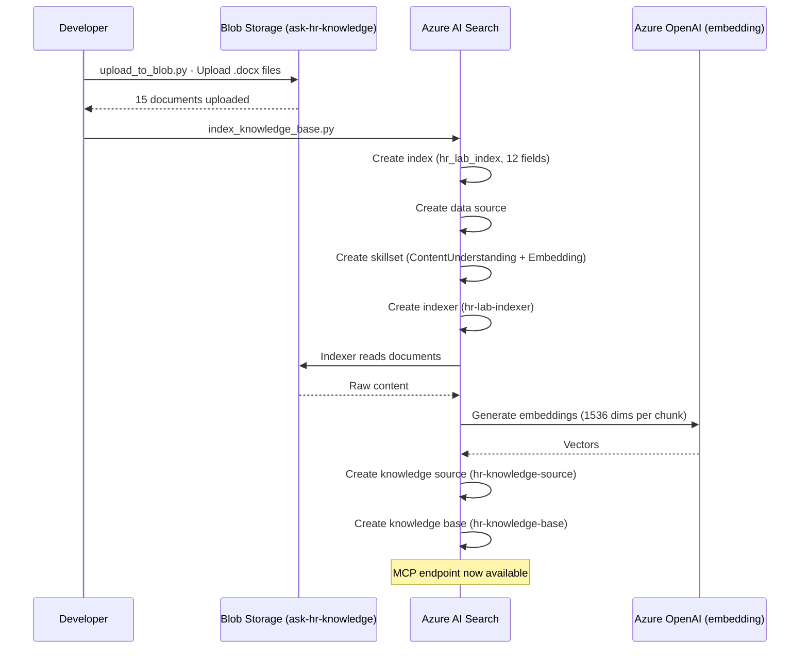
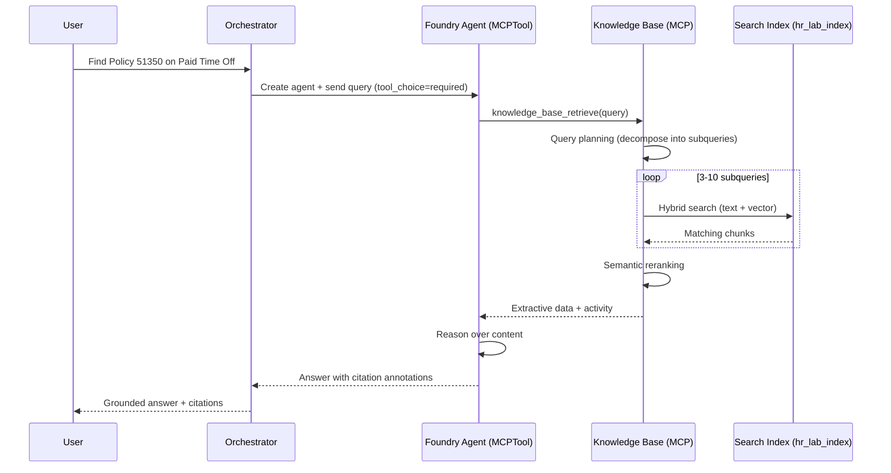
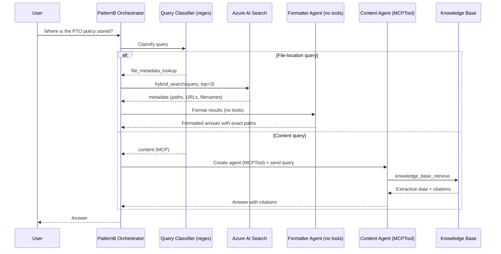

# End-to-End Walkthrough: Agentic Retrieval with Azure AI Search + Foundry Agent Service

> ⚠️ **Development reference only.** Production deployments must follow the
> [Azure Well-Architected Framework](https://learn.microsoft.com/azure/well-architected/)
> and Microsoft best practices. The default Copilot Studio → Foundry Agent +
> MCP agentic-retrieval pattern in this walkthrough uses **GA-only** Python
> packages (`azure-ai-projects` 2.2.0, `azure-search-documents` 12.0.0).
> Preview Microsoft Agent Framework experimentation lives under
> [`src/agents_af/`](../src/agents_af/README.md) and is isolated to a separate
> virtual environment — do not ship it.

This walkthrough guides you step-by-step through the complete HR Policy Knowledge Base pipeline — from uploading documents to getting grounded answers with citations. Each pattern is explained with its purpose, the gap it resolves, and sample terminal output.

> **Reference:** This solution follows the [Microsoft Tutorial: Build an end-to-end agentic retrieval solution](https://learn.microsoft.com/en-us/azure/search/agentic-retrieval-how-to-create-pipeline), adapted to an HR policy knowledge base with Pattern A/B orchestration and evaluation harness.

---

## Table of Contents

1. [Understand the Solution](#1-understand-the-solution)
2. [Prerequisites](#2-prerequisites)
3. [Set Up Your Environment](#3-set-up-your-environment)
4. [Upload Documents to Blob Storage](#4-upload-documents-to-blob-storage)
5. [Create the Search Index and Agentic Retrieval Resources](#5-create-the-search-index-and-agentic-retrieval-resources)
6. [Pattern A: Single-Agent MCP (Default)](#6-pattern-a-single-agent-mcp-default)
7. [Pattern B: Hybrid MCP + Metadata Lookup](#7-pattern-b-hybrid-mcp--metadata-lookup)
8. [Understanding Subqueries (Query Decomposition)](#8-understanding-subqueries-query-decomposition)
9. [Running Tests and Viewing Results](#9-running-tests-and-viewing-results)
10. [What Each Pattern Solves](#10-what-each-pattern-solves)
11. [Troubleshooting](#11-troubleshooting)

---

## 1. Understand the Solution

This solution combines **Azure AI Search** and **Microsoft Foundry** to create an end-to-end retrieval pipeline for HR policy documents:

```
┌────────────────────────────────────────────────────────────────────────────┐
│                          AZURE AI SEARCH                                   │
│                                                                            │
│   Blob Storage  ──►  Indexer + Skillset  ──►  Search Index (hr_lab_index) │
│   (ask-hr-knowledge)    (chunking +                                        │
│                          embeddings)                                       │
│                                                                            │
│   Search Index  ──►  Knowledge Source  ──►  Knowledge Base                │
│                      (hr-knowledge-source)  (hr-knowledge-base)            │
│                                                    │                       │
│                                              MCP Endpoint                  │
│                                     (knowledge_base_retrieve tool)         │
└────────────────────────────────────────────────────┬───────────────────────┘
                                                     │
                                                     ▼
┌────────────────────────────────────────────────────────────────────────────┐
│                          MICROSOFT FOUNDRY                                 │
│                                                                            │
│   Project Connection  ──►  Foundry Agent  ──►  Conversations API          │
│   (points to MCP)         (MCPTool)           (stream response)           │
│                                                                            │
└────────────────────────────────────────────────────────────────────────────┘
                                                     │
                                                     ▼
                                            User / Copilot Studio
```

**How it works:**

1. **Azure AI Search** hosts the knowledge base — it handles query planning, query execution (including subquery decomposition), semantic reranking, and result consolidation.
2. **Microsoft Foundry** hosts the agent — the Foundry Agent uses the MCPTool to call the knowledge base, then reasons over retrieved content and produces a cited answer.
3. A user interacts via a client app (Copilot Studio, Teams, or the test scripts). The agent determines when to query the knowledge base and synthesizes a natural-language response.

---

## 2. Prerequisites

| Requirement | Details |
|-------------|---------|
| Azure AI Search | Any region with [agentic retrieval support](https://learn.microsoft.com/en-us/azure/search/search-region-support) |
| Microsoft Foundry project | With a deployed LLM (e.g., `gpt-5` or `gpt-4.1`) |
| Text embedding model | `text-embedding-3-small` (1536 dimensions), deployed in your project |
| Python 3.13+ | With `uv` or `pip` for dependency management |
| Azure CLI | For keyless authentication (`az login`) |
| VS Code | Recommended, with Python extension |

**RBAC roles required:**

| Resource | Role | Who |
|----------|------|-----|
| Search Service | Search Index Data Reader | Your user + project managed identity |
| Search Service | Search Service Contributor | Your user |
| Foundry Project | Foundry User | Your user |
| Foundry Project | Foundry Project Manager | Your user |
| Foundry Parent Resource | Cognitive Services User | Search service managed identity |

---

## 3. Set Up Your Environment

```bash
# Clone the repository
git clone https://github.com/honestypugh2/foundry-copilot-search-validate.git
cd foundry-copilot-search-validate

# Create and activate virtual environment
python -m venv .venv
source .venv/bin/activate

# Install dependencies
pip install -r requirements.txt

# Copy .env.example and fill in your values
cp .env.example .env
```

**Required `.env` variables:**

```env
AZURE_SEARCH_ENDPOINT=https://<your-search-service>.search.windows.net
AZURE_AI_PROJECT_ENDPOINT=https://<your-resource>.services.ai.azure.com/api/projects/<your-project>
AZURE_AI_MODEL_DEPLOYMENT_NAME=gpt-5
AZURE_SEARCH_INDEX_NAME=hr_lab_index
```

**Authenticate:**

```bash
az login
```

---

## 4. Upload Documents to Blob Storage

Upload HR policy documents from `data/knowledge_base_lab/` to the `ask-hr-knowledge` container:

```bash
PYTHONPATH=$PWD/src python -m scripts.upload_to_blob
```

**What this does:**
- Reads `.docx` and `.doc` files from `data/knowledge_base_lab/`
- Uploads them to Azure Blob Storage container `ask-hr-knowledge`
- Preserves folder structure for organization

**Sample output:**
```
Uploading 15 documents to container 'ask-hr-knowledge'...
  ✓ 51350 - Types of Leave_ Paid Time Off (PTO) (23472_2).docx
  ✓ 52005 - Operational Matters_ Uniform Dress Code (2583_19).docx
  ✓ 87100 - Generative Artificial Intelligence (AI)...
  ...
✓ Upload complete: 15 documents
```

---

## 5. Create the Search Index and Agentic Retrieval Resources

```bash
PYTHONPATH=$PWD/src python scripts/index_knowledge_base.py
```

### Data Pipeline Sequence



**What this creates (in order):**

| Resource | Purpose |
|----------|---------|
| **Search Index** (`hr_lab_index`) | Stores chunked documents with vector embeddings |
| **Data Source** | Points the indexer at Blob Storage |
| **Skillset** | ContentUnderstanding (chunking) + Embedding (text-embedding-3-small) |
| **Indexer** | Runs the skillset against blobs, populates the index |
| **Knowledge Source** (`hr-knowledge-source`) | Reusable reference to the index for agentic retrieval |
| **Knowledge Base** (`hr-knowledge-base`) | Orchestrates agentic retrieval from the knowledge source |

**Key settings in the Knowledge Base:**
- `output_mode = EXTRACTIVE_DATA` — returns verbatim source content (not pre-synthesized answers)
- `retrieval_reasoning_effort = medium` — enables LLM-based query planning with subquery decomposition

**The MCP endpoint** is automatically available after knowledge base creation:
```
https://<search-service>.search.windows.net/knowledgebases/hr-knowledge-base/mcp?api-version=2025-11-01-Preview
```

**Sample output:**
```
Creating index 'hr_lab_index'...
  ✓ Index created with 12 fields (snippet_vector: 1536 dims)
  ✓ Semantic config: hr-lab-semantic-config
Creating data source...
  ✓ Data source 'hr-lab-datasource' → container 'ask-hr-knowledge'
Creating skillset 'hr-lab-skillset'...
  ✓ Skills: ContentUnderstandingSkill → AzureOpenAIEmbeddingSkill
Creating indexer 'hr-lab-indexer'...
  ✓ Indexer running (processing documents...)
Creating knowledge source 'hr-knowledge-source'...
  ✓ Knowledge source → index 'hr_lab_index'
Creating knowledge base 'hr-knowledge-base'...
  ✓ Knowledge base created (output_mode=EXTRACTIVE, reasoning=medium)
  ✓ MCP endpoint: https://srch-....search.windows.net/knowledgebases/hr-knowledge-base/mcp?api-version=2025-11-01-Preview
```

---

## 6. Pattern A: Single-Agent MCP (Default)

**Pattern A** is the Microsoft recommended architecture. A single Foundry Agent with an MCPTool handles retrieval, reasoning, and citation formatting in **one pass**.

### How It Works

```
User Query
    │
    ▼
Foundry Agent (MCPTool, tool_choice="required")
    │
    ├─── MCP call → knowledge_base_retrieve
    │         │
    │         ▼
    │    Azure AI Search Knowledge Base
    │         ├─ Query decomposition (subqueries)
    │         ├─ Hybrid search (text + vector + semantic)
    │         ├─ Semantic reranking
    │         └─ Extractive data consolidation
    │         │
    │         ▼
    │    Retrieved content (references + activity)
    │
    ├─── Agent reasons over retrieved content
    │
    ▼
Answer with MCP citations: 【0:1†source_name】
```

### Sequence Diagram



### Run Pattern A

```bash
# Default — Pattern A is the default
PYTHONPATH=$PWD/src python tests/test_mcp_query_retrieval.py --query_id=1

# Explicit
ORCHESTRATOR_PATTERN=A PYTHONPATH=$PWD/src python tests/test_mcp_query_retrieval.py --query_id=1
```

### Sample Output (Pattern A)

```
╔════════════════════════════════════════════════════════════════════╗
║  Live E2E – MCP Query Retrieval (Pattern A)                       ║
║  Mode: LIVE (no mocks)                                            ║
║  Output Mode: EXTRACTIVE                                          ║
║  Pipeline: Orchestrator (Pattern A) → MCP → Citations             ║
╚════════════════════════════════════════════════════════════════════╝

  ┌──────────────────────────────────────────────────────────────
  ▶ QUERY 1/1: Find Policy 51350 on Paid Time Off
    expect: policy=51350  file=51350 - Types of Leave_ Paid Time Off (PTO) (23472
  └──────────────────────────────────────────────────────────────

    ⮜ OUTPUT:
      status     : completed
      output_mode: extractive
      answer     : The file is located at: https://st...blob.core.windows.net/
                   ask-hr-knowledge/knowledge_base_lab/51350%20-%20Ty...
      elapsed    : 77.76s
      citations  : 4
      cite_valid : has_citations=True, count=4
      ┌─ Token Usage ─────────────────────────────────
      │ Prompt: 3364 │ Output: 2152 │ Total: 5516
      └───────────────────────────────────────────────
      ┌─ Subqueries ──────────────────────────────────
      │ Subquery                                 │  Count │ Elapsed MS
      │ ──────────────────────────────────────────────────────────────
      │ "Policy 51350"                           │      1 │         60
      │ "51350" Paid Time Off                    │      4 │         66
      │ PTO policy 51350                         │      4 │         89
      │ "Policy No. 51350" PTO                   │      4 │         44
      │ Paid Time Off policy document 51350      │      4 │         81
      └───────────────────────────────────────────────
    ✓ expected policy 51350 FOUND in answer
    ✓ expected file reference FOUND in answer
    ✓ MCP citations present (4)
    ✓ PASSED
```

### What Pattern A Returns

```python
{
    "status": "completed",
    "answer": "The file is located at: https://...",
    "model": "gpt-5",
    "output_mode": "extractive",
    "pipeline_mode": "single_agent",
    "pattern": "A",
    "is_grounded": True,
    "token_usage": {"prompt_tokens": 3364, "completion_tokens": 2152, "total_tokens": 5516},
    "activity": [
        {"id": 0, "type": "modelQueryPlanning", "elapsed_ms": 3520, ...},
        {"id": 1, "type": "searchIndex", "elapsed_ms": 114, "count": 6,
         "search_index_arguments": {"search": "PTO policy", ...}},
        ...
    ],
    "citation_validation": {
        "has_citations": True,
        "citation_count": 4,
        "citations": [{"message_idx": 0, "search_idx": 0, "source_name": "51350 - ..."}]
    }
}
```

### Gap Pattern A Resolves

| Problem Before | How Pattern A Solves It |
|----------------|------------------------|
| Multi-step pipelines perform **double retrieval** (search index → then MCP searches again) | **Single retrieval** — one MCP call does everything |
| Multi-agent coordination adds latency and complexity | **One agent** handles retrieval + reasoning + citation |
| Source validation requires manual container filtering | **Infrastructure-level trust** — index only contains trusted docs |
| Citation extraction is brittle (regex on LLM output) | **Native MCP annotations** generated by the agent with tool output |

---

## 7. Pattern B: Hybrid MCP + Metadata Lookup

**Pattern B** extends Pattern A by adding **client-side query classification** that routes file-location queries to a direct index search, bypassing MCP entirely for those queries. This resolves the gap where Pattern A's LLM may hallucinate file paths.

### The Gap Pattern B Resolves

When a user asks "Where is the PTO policy document stored?", Pattern A has the agent synthesize the file path from retrieved content. But:

- The LLM may **hallucinate** a path that looks correct but doesn't exist
- The LLM may say "path not available" even when `metadata_storage_path` is in the source data
- File paths are **deterministic facts** that should come directly from the index, not LLM synthesis

Pattern B provides a **dedicated tool** that returns metadata fields directly from the search index — no LLM reasoning involved for file locations.

### How It Works

```
User Query
    │
    ▼
Client-Side Query Classification (regex-based)
    │
    ├─── Content question: "What does the PTO policy say?"
    │         │
    │         ▼  Foundry Agent (MCPTool only, tool_choice="required")
    │         │
    │         ├─── MCP call → knowledge_base_retrieve
    │         │         │
    │         │         ▼
    │         │    Azure AI Search Knowledge Base
    │         │         ├─ Query decomposition (subqueries)
    │         │         ├─ Hybrid search (text + vector + semantic)
    │         │         ├─ Semantic reranking
    │         │         └─ Extractive data consolidation
    │         │
    │         └─── Agent reasons + Answer with MCP citations
    │
    └─── File-location question: "Where is the PTO policy stored?"
              │
              ▼  file_metadata_lookup (called directly, no agent tool routing)
              Azure AI Search direct query (hybrid_search)
              └─► Only metadata fields returned:
                  {
                    "metadata_storage_path": "https://st...blob.core.windows.net/...",
                    "metadata_storage_name": "51350 - Types of Leave_ PTO.docx",
                    "blob_url": "https://st...blob.core.windows.net/..."
                  }
              │
              ▼  Agent formats results (no tools, just text)
              Deterministic file paths presented to user
```

### Sequence Diagram



### Run Pattern B

```bash
PYTHONPATH=$PWD/src python tests/test_mcp_query_retrieval.py --query_id=21 --pattern B
```

### Sample Output (Pattern B)

```
╔════════════════════════════════════════════════════════════════════╗
║  Live E2E – MCP Query Retrieval (Pattern B)                       ║
║  Mode: LIVE (no mocks)                                            ║
║  Output Mode: EXTRACTIVE                                          ║
║  Pipeline: Orchestrator (Pattern B) → MCP → Citations             ║
╚════════════════════════════════════════════════════════════════════╝

  ┌──────────────────────────────────────────────────────────────
  ▶ QUERY 1/1: Where is the PTO policy document stored?
    expect: policy=51350  file=51350 - Types of Leave_ Paid Time Off (PTO) (23472
  └──────────────────────────────────────────────────────────────

    ⮜ OUTPUT:
      status     : completed
      output_mode: extractive
      answer     : - File name: 51350 - Types of Leave_ Paid Time Off (PTO) (23472_2).docx
                     - Storage path: https://stovcrqidayerac.blob.core.windows.net/
                       ask-hr-knowledge/knowledge_base_lab/51350%20-%20Types%20of%20
                       Leave_%20Paid%20Time%20Off%20(PTO)%20(23472_2)/51350%20-...
                     - Policy number: 51350
                     - Reranker score: 2.03

                   - File name: 51355 - Types of Leave_ Paid Time Off (PTO) - Part-time (23315_2).docx
                     - Storage path: https://stovcrqidayerac.blob.core.windows.net/...
                     - Policy number: 51355

      elapsed    : 23.5s
      ┌─ Token Usage ─────────────────────────────────
      │ Prompt: 901 │ Output: 1489 │ Total: 2390
      └───────────────────────────────────────────────
    ✓ expected policy 51350 FOUND in answer
    ✓ expected file reference FOUND in answer
    ✓ PASSED
```

### Key Differences from Pattern A

| Aspect | Pattern A | Pattern B |
|--------|-----------|-----------|
| Tools on agent | MCPTool only | MCPTool (content) or none (file-location) |
| Query routing | Agent always calls MCP | Client-side classification (regex) |
| Content questions | MCP (platform-handled) | MCP (platform-handled, same as A) |
| File-location questions | LLM synthesizes path (may hallucinate) | **Deterministic** — direct index lookup |
| Content citations | Native MCP annotations | Native MCP annotations (same as A) |
| Latency (content queries) | ~10-15s | ~10-15s (same — MCPTool only) |
| Latency (file queries) | ~10-15s (full KB retrieval) | ~5-10s (targeted hybrid search) |
| Client-side complexity | Minimal | Moderate (query classifier + two pipelines) |

### Implementation Detail: Client-Side Query Classification

The Foundry platform ignores `tool_choice` overrides when MCPTool is registered —
it always routes to `knowledge_base_retrieve` regardless of agent instructions.
Pattern B solves this with **client-side classification**:

1. A regex classifier detects file-location intent ("where is", "file path",
   "blob URL", "stored", "located", etc.)
2. **File-location queries**: `file_metadata_lookup()` is called directly
   (bypasses the agent's tool routing entirely), then the results are passed
   to the agent with no tools registered — the agent just formats the
   deterministic metadata for the user.
3. **Content queries**: A Foundry Agent is created with MCPTool only (no
   FunctionTool), allowing the platform to handle MCP natively — same as
   Pattern A, with full citations.

This architecture ensures:
- File-location queries get deterministic paths (no hallucination)
- Content queries get native MCP citations (not intercepted)
- No MCP interception loop needed — platform handles MCP transparently
- Fast file-location responses (~5-10s vs ~15s with full KB retrieval)

---

## 8. Understanding Subqueries (Query Decomposition)

When the knowledge base has `retrieval_reasoning_effort` set to `medium` or higher, it uses an LLM to decompose the user's query into focused subqueries before searching. This is visible in the **activity** data.

### Activity Structure

Each agentic retrieval call returns an activity array:

```python
result["activity"] = [
    # Step 0: Query planning (LLM decomposes the query)
    {
        "id": 0,
        "type": "modelQueryPlanning",
        "elapsed_ms": 3520,
        "input_tokens": 1687,
        "output_tokens": 193
    },
    # Steps 1-N: Individual subqueries against the index
    {
        "id": 1,
        "type": "searchIndex",
        "elapsed_ms": 114,
        "knowledge_source_name": "hr-knowledge-source",
        "count": 6,
        "search_index_arguments": {
            "search": "PTO policy",
            "source_data_fields": [...]
        }
    },
    {
        "id": 2,
        "type": "searchIndex",
        "elapsed_ms": 78,
        "count": 7,
        "search_index_arguments": {
            "search": "paid time off policy"
        }
    },
    # ... more subqueries
]
```

### How Subqueries Improve Retrieval

For the query "Find Policy 51350 on Paid Time Off", the knowledge base might decompose it into:

| Subquery | Count | Elapsed MS |
|----------|-------|-----------|
| "Policy 51350" | 1 | 60 |
| "51350" Paid Time Off | 4 | 66 |
| PTO policy 51350 | 4 | 89 |
| "Policy No. 51350" PTO | 4 | 44 |
| Paid Time Off policy document 51350 | 4 | 81 |

Each subquery targets the index from a different angle (exact match, keyword combinations, natural language). Results are merged and reranked to produce the final retrieved content.

### Controlling Subquery Behavior

Set in `src/config/search_config.json` under `agentic_retrieval`:

```json
{
    "agentic_retrieval": {
        "retrieval_reasoning_effort": "medium",
        "include_activity": true
    }
}
```

| Reasoning Effort | Behavior |
|-----------------|----------|
| `minimal` | No LLM query planning — single keyword query (fastest, cheapest) |
| `low` | Light query planning with 1-2 subqueries |
| `medium` | Full query planning with 3-10+ subqueries (recommended) |

---

## 9. Running Tests and Viewing Results

### Test Scripts

| Script | Purpose | Pattern |
|--------|---------|---------|
| `tests/test_mcp_query_retrieval.py` | Primary test — runs queries through the orchestrator | A or B (via `--pattern`) |
| `tests/e2e_live_foundry_service.py` | Full pipeline test — registers agents, tests individually, then orchestrator | Respects `PIPELINE_MODE` |
| `tests/test_file_location_retrieval.py` | Validates file-location queries specifically | B |
| `tests/test_agentic_retrieval_extractive.py` | Unit/integration tests for extractive mode | Mock + Live |

### Running Specific Queries

```bash
# Single query by ID (Pattern A)
PYTHONPATH=$PWD/src python tests/test_mcp_query_retrieval.py --query_id=5

# Single query (Pattern B)
PYTHONPATH=$PWD/src python tests/test_mcp_query_retrieval.py --query_id=21 --pattern B

# First 5 queries
PYTHONPATH=$PWD/src python tests/test_mcp_query_retrieval.py --limit 5

# All 33 queries
PYTHONPATH=$PWD/src python tests/test_mcp_query_retrieval.py
```

### Running the Full E2E Pipeline

```bash
# Default (single_agent mode — tests Pattern A orchestrator)
PYTHONPATH=$PWD/src python tests/e2e_live_foundry_service.py

# Multi-step mode (tests the legacy 4-step pipeline)
PIPELINE_MODE=multi_step PYTHONPATH=$PWD/src python tests/e2e_live_foundry_service.py
```

### Results Files

After running tests, results are written to:

| File | Content |
|------|---------|
| `tests/mcp_query_retrieval_results.json` | Per-query pass/fail, answer text, citations, activity |
| `tests/e2e_live_foundry_results.json` | Step pass/fail summary |
| `logs/test_mcp_query_retrieval.log` | Full plain-text log with subqueries and timing |
| `logs/e2e_live_foundry_service.log` | Full plain-text log for e2e pipeline |

### Query Categories in the Test Suite

| IDs | Category | Example |
|-----|----------|---------|
| 1–4 | Exact policy number lookup | "Find Policy 51350 on Paid Time Off" |
| 5–7 | Topic/title lookup (no number) | "Show me the Short-Term Disability policy" |
| 8–10 | Natural language questions | "What is the PTO policy?" |
| 11–15 | Cross-reference (number + topic) | "Show me the probationary period requirements from Policy 50455" |
| 16–18 | Disambiguation | "What is the PTO accrual rate for part-time employees?" |
| 19–20 | Career path lookups | "What is the career path for an HR Generalist?" |
| 21–33 | File location queries | "Where is the PTO policy document stored?" |

---

## 10. What Each Pattern Solves

### Decision Matrix

| Scenario | Use Pattern A | Use Pattern B |
|----------|:---:|:---:|
| Content/policy questions | ✓ | ✓ |
| Simple "what does X say?" queries | ✓ (preferred) | ✓ |
| File-location queries needing exact paths | ⚠️ (may hallucinate) | ✓ (deterministic) |
| Minimum latency for content | ✓ (~15s) | ✓ (~15s, same MCP path) |
| Minimum latency for file lookups | ⚠️ (~15s) | ✓ (~8s) |
| Simplest implementation | ✓ | |
| Native MCP citations | ✓ | ✓ (content queries) |
| Production: content-only use case | ✓ | |
| Production: content + file-location | | ✓ |

### Evolution of the Pipeline

```
v1: Multi-Step Pipeline (PIPELINE_MODE=multi_step)
    ─────────────────────────────────────────────
    Problem: Double retrieval, high latency, complex orchestration
    Gap: 4 agents doing what 1 can do; index queried twice
         │
         ▼
v2: Pattern A — Single-Agent MCP (ORCHESTRATOR_PATTERN=A)
    ────────────────────────────────────────────────────────
    Resolves: Single retrieval, single agent, infrastructure trust
    Gap: File-location queries get hallucinated paths
         │
         ▼
v3: Pattern B — Hybrid MCP + Metadata (ORCHESTRATOR_PATTERN=B)
    ──────────────────────────────────────────────────────────────
    Resolves: Deterministic file paths via client-side classification
    Gap: Slightly higher complexity (two pipeline paths)
```

### Summary Table

| Pattern | Architecture | Retrieval Calls | Best For |
|---------|-------------|:-:|------|
| Multi-Step | 4 agents, sequential | 2 | Learning/experimentation |
| **Pattern A** | 1 agent, MCPTool | 1 | Content questions (default) |
| **Pattern B** | Client-classified: MCPTool or direct search | 1 | Content + file-location queries |

---

## 11. Troubleshooting

### "Activity capture failed (non-blocking)"

Pattern A captures subquery data via a **secondary** `agentic_retrieve()` call after the agent responds. If this fails (timeout, auth), the answer is still valid — you just won't see subqueries in the output. Pattern B captures activity from the content pipeline's MCP handling.

### Empty Subqueries Table

If the subqueries table prints headers but no rows, verify:
- `src/config/search_config.json` → `"include_activity": true`
- `"retrieval_reasoning_effort": "medium"` (not `"minimal"`)
- The SDK returns snake_case fields: `search_index_arguments`, `elapsed_ms` (not camelCase)

### Agent Response is Slow (60-80s)

First-run latency is expected due to:
- Agent creation in Foundry (~2s)
- Conversation creation (~1s)
- MCP tool invocation → knowledge base query planning (~3-5s)
- Multiple subqueries against the index (~0.5-1s each × 5-10 subqueries)
- LLM reasoning and response generation (~5-10s)

Subsequent queries in the same session are faster. To reduce latency:
- Set `retrieval_reasoning_effort` to `"low"` or `"minimal"`
- Use a faster model (`gpt-4.1-mini`)
- Set `PERSIST_FOUNDRY_AGENTS=true` to reuse agents across runs

### "MCP citation annotations not found"

The agent may not always produce citations in the expected `【0:1†source_name】` format. This can happen when:
- The agent decides to paraphrase rather than cite directly
- The model version handles annotations differently
- The query is too vague to ground in specific sources

Enable `VALIDATE_CITATIONS=true` to track citation presence across queries.

### File Path Hallucination (Pattern A)

If the agent returns a file path that doesn't match the actual blob storage path, switch to Pattern B:

```bash
ORCHESTRATOR_PATTERN=B PYTHONPATH=$PWD/src python tests/test_mcp_query_retrieval.py --query_id=21 --pattern B
```

Pattern B's `file_metadata_lookup` tool returns the exact `metadata_storage_path` from the index — no LLM synthesis involved.
